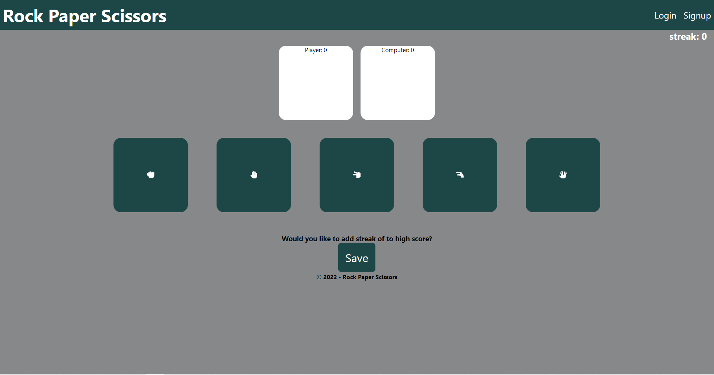
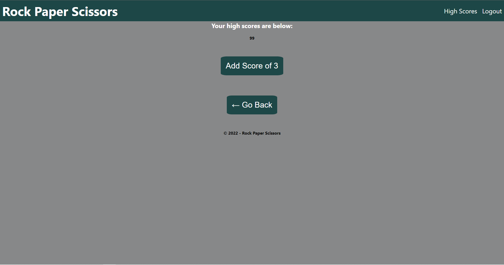
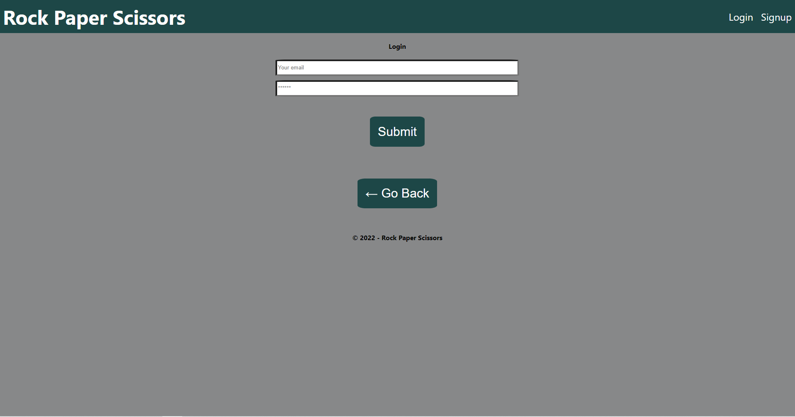

# scissors-paper-rock

## Licencing
 
 
This licence is covered under the licence of MIT Licence. 

## Table Of Contents
[licencing](#licencing) 

[description](#description) 

[technologies](#technologies) 

[Installation](#installation) 

[Usage](#usage) 

[Contributing](#contributing) 

[Tests](#tests) 

[Questions](#questions) 

## Description
The purpose of this project is to allow a user to play scissors paper rock against a computer and keep track of the best streaks against the computer.  

## Technologies
Express.js
MongoDB
React
React Router
Node.js
Apollo GraphQl
ReactLocalStorage
Javascript
CSS
HTML

## Installation
To correctly install this project either download the code as a zip or git fork the repostiory. 

## Usage
To use this project either click [here](https://ethan-tech-blog.herokuapp.com) and start playing. Or once a copy of the repository has been downloaded type `npm i` in the root command line of the repository, then run `npm run develop`. The application will then be ready in the browser on localhost. The application should look like the following: 

## Contributing 
To contribute to this project please contact me on ethan.godley@hotmail.com in regards to any contributions. 

## Tests
To test the project Please run manual tests as tests have not been premande.  
 
## Questions 
Please find the link to my github profile below, along with my email address should a user or developer have any further questions 

https://github.com/ethangodley ethan.godley@hotmail.com